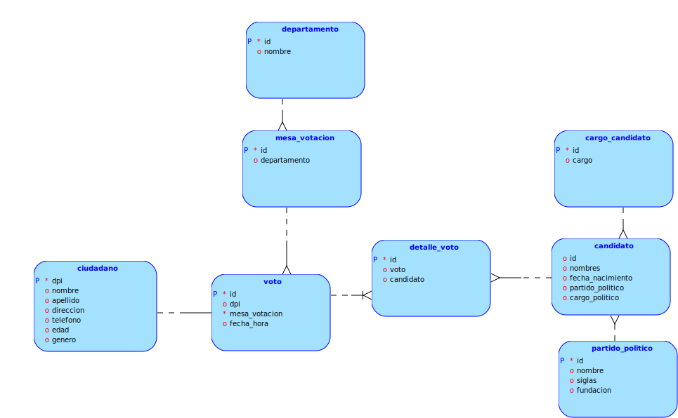

# **Proyecto 1**
### Universidad de San Carlos de Guatemala
### Facultad de Ingeniería
### Escuela de Ciencias y Sistemas
### Sistema de Bases de Datos 1
  

## **Manual Técnico**
  

| Nombre | Carnet | 
| --- | --- |
| Damián Ignacio Peña Afre | 202110568 |
----

## **Tabla de Contenido**

## **Descripción del Proyecto**

El Tribunal Supremo Electoral (TSE) tiene la responsabilidad crucial de recopilar los resultados de las elecciones de diversas mesas distribuidas en todo el territorio nacional. En este contexto, se busca su colaboración para implementar un sistema de bases de datos capaz de realizar consultas que permitan verificar la coherencia entre los reportes manuales y los generados por el sistema de bases de datos. El objetivo primordial es establecer un proceso transparente y confiable que garantice la integridad y precisión de los resultados electorales.

## **Modelo conceptual de la base de datos**

## **Modelo lógico de la base de datos**

## **Modelo físico de la base de datos**

1. Tabla departamento:
* id: Clave primaria, tipo INT.
* nombre: Nombre del departamento, tipo VARCHAR (50), no nulo.

2. Tabla partido_político:
* id: Clave primaria, tipo INT.
* nombre: Nombre del partido político, tipo VARCHAR (50), no nulo.
* siglas: Siglas del partido político, tipo VARCHAR (10), no nulo.
* fundación: Fecha de fundación del partido político, tipo DATE, no nulo.

3. Tabla cargo_candidato:
* id: Clave primaria, tipo INT.
* cargo: Nombre del cargo al que puede aspirar un candidato, tipo VARCHAR (50), no nulo.

4. Tabla ciudadano:
* dpi: Clave primaria, tipo BIGINT.
* nombre: Nombre del ciudadano, tipo VARCHAR (50), no nulo.
* apellido: Apellido del ciudadano, tipo VARCHAR (50), no nulo.
* direccion: Dirección del ciudadano, tipo VARCHAR (50), no nulo.
* telefono: Número de teléfono del ciudadano, tipo BIGINT, no nulo.
* edad: Edad del ciudadano, tipo INT, no nulo.
* genero: Género del ciudadano, tipo CHAR(1), no nulo.

5. Tabla mesa_votacion:
* id: Clave primaria, tipo INT.
* departamento: ID del departamento al que pertenece la mesa de votación, tipo INT.
* FOREIGN KEY (departamento): Clave foránea que referencia la tabla departamento por su campo id.

6. Tabla candidato:
* id: Clave primaria, tipo INT.
* nombres: Nombres del candidato, tipo VARCHAR (50), no nulo.
* fecha_nacimiento: Fecha de nacimiento del candidato, tipo DATE, no nulo.
* partido_politico: ID del partido político al que pertenece el candidato, tipo INT.
* cargo_candidato: ID del cargo al que aspira el candidato, tipo INT.
* FOREIGN KEY (partido_politico): Clave foránea que referencia la tabla partido_politico por su campo id.
* FOREIGN KEY (cargo_candidato): Clave foránea que referencia la tabla cargo_candidato por su campo id.

7. Tabla voto:
* id: Clave primaria, tipo INT.
* dpi: DPI del ciudadano que emitió el voto, tipo BIGINT, no nulo.
* mesa_votacion: ID de la mesa de votación en la que se emitió el voto, tipo INT, no nulo.
* fecha_hora: Fecha y hora en que se emitió el voto, tipo DATETIME, no nulo.
* FOREIGN KEY (dpi): Clave foránea que referencia la tabla ciudadano por su campo dpi.
* FOREIGN KEY (mesa_votacion): Clave foránea que referencia la tabla mesa_votacion por su campo id.

8. Tabla detalle_voto:

La creación de la tabla detalle_voto es necesaria para manejar la relación de muchos a muchos entre la tabla voto y la tabla candidato. Esto se debe a que un voto puede estar relacionado con múltiples candidatos y, a su vez, un candidato puede recibir votos de varios ciudadanos en una elección.

* id: Clave primaria autoincremental, tipo INT.
* voto: ID del voto al que pertenece el detalle, tipo INT, no nulo.
* candidato: ID del candidato por el cual se emitió el voto, tipo INT, no nulo.
* FOREIGN KEY (voto): Clave foránea que referencia la tabla voto por su campo id.
* FOREIGN KEY (candidato): Clave foránea que referencia la tabla candidato por su campo id.
* Este modelo físico de la base de datos permite almacenar información relacionada con departamentos, partidos políticos, cargos de candidatos, ciudadanos, mesas de votación, candidatos, votos y detalles de votos, lo que proporciona una estructura sólida para el seguimiento de elecciones y votaciones. Las relaciones entre las tablas garantizan la integridad referencial de los datos.

